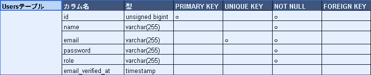
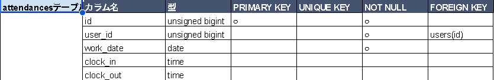
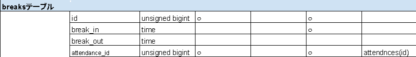
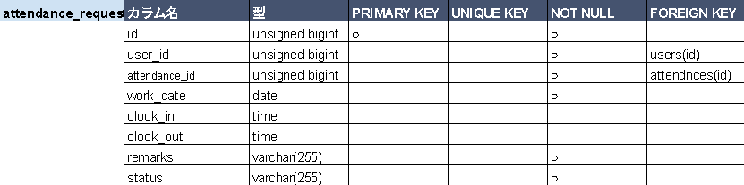
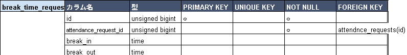
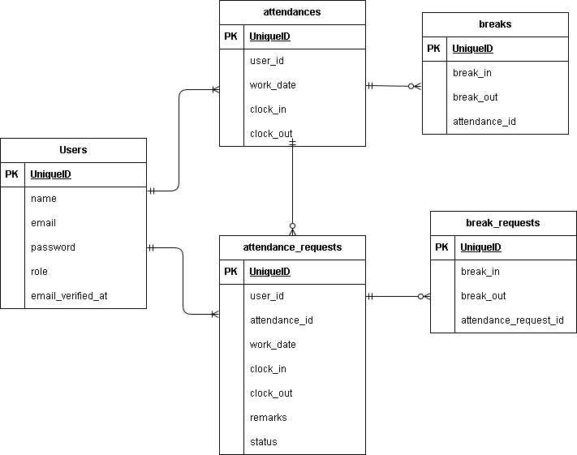

#アプリケーション名

coachtech勤怠管理アプリ

## 環境構築

git clone git@github.com:WDRNT/mogitest-2.git
cp .env.example .env
docker-compose up -d --build
docker-compose exec php bash
composer install
php artisan key:generate
php artisan migrate --seed
php artisan storage:link

## 使用技術

PHP 8.X
Laravel 8.1
nginx:1.21.1
MySQL
Docker
Mailhog

## 認証

Laravel Fortifyを使用

## メール認証

Mailhogを使用

http://localhost:8025

## URL
開発環境: http://localhost/

## テーブル仕様書

## ER図
